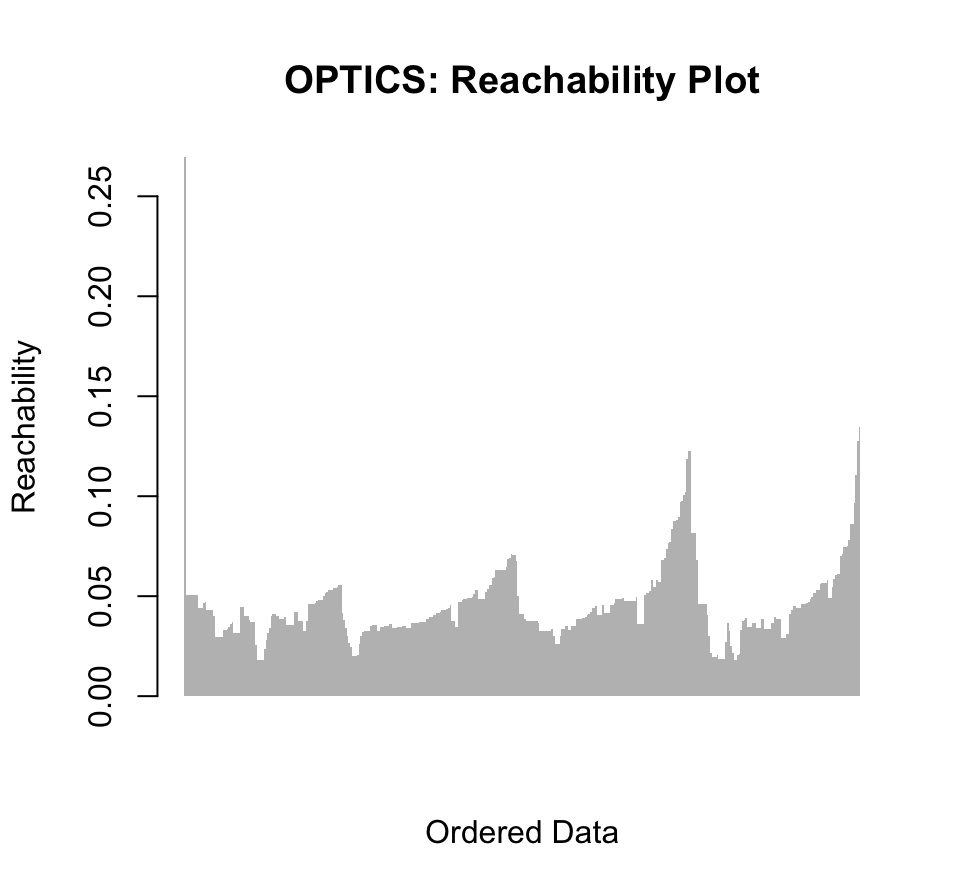

```{r, include = FALSE}
knitr::opts_chunk$set(
  collapse = TRUE,
  comment = "#>"
)
```

```{r setup}
library(Clustering)
library(ggplot2)
library(dplyr)
set.seed(13)
```

This package implements the main clustering algorithms.

Clustering is a key technique in unsupervised learning.

Unsupervised learning aims to find patterns in a training set $X \in \mathbb{R}^{n\times d}$ with instances $X_i \in \mathbb{R}^d, i=1,...,n$ without any (or minimal) external information and in some cases can even make predictions based on that.

This is best illustrated by an example. Let us take a look the `iris` data set. It contains the sepal lengths and widths, petal lengths and widths and species of different irises. If you take a closer look at the petal lengths and widths in relation to the species, we find that they are closely correlated:

```{r, fig.width=5, fig.height=4, fig.align='center'}
ggplot() + 
  geom_point(data=iris, aes(x=Petal.Length, y=Petal.Width, color=Species)) +
  ggtitle("Iris Petals") + 
  theme_bw()
```

Based on this plot one can easily conduct that irises of the species virginica tend to have large petals while irises of the species setosa have rather smaller petals. In the above plot these species form their own clusters.

The objective of a clustering algorithm would be to find these clusters without any previous knowledge of the data. And some algorithms even allow us to predict, given a petal length and width, which cluster a new instance would belong to.

There are multiple clustering algorithms, each with its different strengths and weaknesses which will be illustrated here.

## k-means clustering

`k_means` clustering is an iterative algorithm and the most widespread clustering algorithm. Having complexity $O(n)$ it is very efficient even for huge data sets.

The algorithm takes, besides the data, an integer `k` (in this package for better readability `num_cluster`) as input, which sets the desired number of clusters. The algorithm then finds `k` approximately optimal cluster centers and each point in the data set is being assigned to the closest cluster centroid. This optimality is with respect to the minimal euclidian distance between clusters, resulting in that the points which are very close to each other will most likely get clustered together.

The k-means algorithm expects a matrix as input. To come back to the example in the beginning, we are going to take a look at the petal sizes in the iris data set.

As an unsupervised learning algorithm, `k_means` only needs the petal length and width as input which we transform into a matrix:

```{r}
irisPetals <- iris |> select(c(Petal.Length,Petal.Width)) |> data.matrix()
```

Now we need the second input for the `k_means` function, the desired number of clusters. Here we run into the main bottle neck of k-means clustering: we need to manually choose the best number for `num_cluster`. Therefore we do need some additional information about the data if we do not want to set the parameter by trial and error.

In this case we have seen a plot of the data and know, that clustering in the data into three clusters is sensible.

```{r}
petals_km <- k_means(irisPetals, 3)
petals_km
```

Apart from the cluster means, the k-means algorithm also returned a logical indicating that it converged and the number of iterations it needed till convergence. Optionally we could also retrieve the cluster means in every iteration.

The package also implemented a function which performs k-means clustering on 2d data and immediately plots the clusters using ggplot:

```{r, fig.width=5, fig.height=4, fig.align='center'}
plot_k_means_2d(irisPetals, 3)
```

As we can see, this plot resembles the plot we saw above a lot. Apart of a few outliers, the algorithm has clustered the right instances together.

We can now also predict, to which cluster two irises with petal lengths $2$ and $6$ and petal widths $0.5$ and $2.7$ would belong to:

```{r}
new_irises <- rbind(c(2,0.5), c(6,2.7))
k_means_predict(new_irises, petals_km$means)
```

Of course, to make sense of these labels, we have to take a look at the means and see which other instances have been clustered to this group.

It is important to note that the algorithm uses a probabilistic method (called `k-means ++`) to find good initial values and assure fast convergence, thus the results may vary if the code is executed multiple times (i.e. slightly different results, rows in `$means` swapped) . This can be prevented by `set.seed()`.

## Overview spectral-clustering algorithm

`spectral_clustering`is a graph-based algorithm, that rearranges given data by giving projections for every point. Often the data gets embedded in a lower dimension, where clusters in the data are more widely separated and can be found easily by applying another algorithm like `k_means`.

The projections are based on eigenvectors of a Laplacian matrix. We receive the Laplacian matrix as a result of an affinity graph that models the neighborhood relationships between data points. To demonstrate the distance relations between the points a kernel function is being used, the Gauß kernel. The goal is thereby not to represent and simplify the location of every point, but the distance between points.

While doing so, the points are getting separated, depending on which cluster they are in, which makes it easier for other algorithms to now assign a cluster to each point.

### Implementation

In this package the spectral clustering algorithm can be called as a function 'spectral_clustering'.

As input it takes `data` a matrix in $\mathbb{R}^n \times \mathbb{R}^d$, where each row represents a data point. A second input is a parameter `dim` in $\mathbb{N}^+$, which is the dimension in which the points shall be represented. A third input is a parameter `h` in $\mathbb{R}^+$, which is the descent parameter of the gausskernel, that is used to build the affinity matrix.

The result of this function is a matrix, that consists the spectral projections computed by the spectral clustering algorithm. They are in the same form as the initial data, meaning each row represents one point. This matrix is in $\mathbb{R}^n \times \mathbb{R}^{dim}$, which shows the embedding in the chosen dimension.

In the following we present some examples of the implemented algorithm and further related functions.

```{r}
irisPetals <- iris |> select(c(Petal.Length,Petal.Width)) |> data.matrix()
```

Looking at the given data closely lets us realize quickly, that our algorithm should separate the points of the following clusters:

```{r}
cluster_iris <- 1:150
cluster_iris[1:50] <- 1
cluster_iris[51:150] <- 2

plot(irisPetals, col = cluster_iris, pch = 19)
```

We now apply the spectral clustering algorithm and we can see, that the two clusters have been separated successfully. The colors show us the initial position of the respective point. (Note: Because of the projection very close to each other the black dot on the left side represents all points of the black cluster)

```{r}
iris_sc <- spectral_clustering(irisPetals)
plot(iris_sc, col = cluster_iris, pch = 19)
```

In the above example the resulting projections are still two-dimensional. In the following graph, you can see, what happens if we let our algorithm compute a one-dimensional embedding of the data.

```{r}
iris_sc <- spectral_clustering(irisPetals, dim = 1)
plot(spectral_clustering(irisPetals, dim = 1), col = cluster_iris, pch = 19)
```

We can see, that the algorithm separated the two clusters successfully. Until now the colors in the plots have been added with knowing in which cluster each points lies to demonstrate the separating. Now we want to see, how we can get the cluster assignment by computation after applying the spectral clustering.

The function plot_spectral_clustering_twoclusters is a simple function to get two clusters out of given data. The function runs the spectral clustering algorithm with $\mathbb dim = 1$ and assigns a cluster to each point by comparing it to the mean of all received onedimensional projections. Applied to the above iris_Petal data the algorithm successfully finds the two clusters. It also returns a vector which shows the cluster assignment for each point.

```{r}
plot_spectral_clustering_twoclusters(irisPetals)
```

Following there is another example with two half moons

```{r}
set.seed(123)
n <- 150
theta <- runif(n, 0, pi)
x1 <- cbind(cos(theta) + rnorm(n, sd = 0.1), sin(theta) + rnorm(n, sd = 0.1))
x2 <- cbind(1 - cos(theta) + rnorm(n, sd = 0.1), 1 - sin(theta) - 0.5 + rnorm(n, sd = 0.1))
data <- rbind(x1, x2)

cluster_halfmoon <- 1:300
cluster_halfmoon[1:150] <- 1
cluster_halfmoon[151:300] <- 2
cluster_halfmoon[224] <-1
plot(data, col = cluster_halfmoon, pch = 19)
```

And the following results. On the left we can see the onedimensional projection and on the right the assignment of clusters. As we can see the three points between both halfmoons are getting assigned "wrongly". An understandable mistake, considering them being close to both clusters.

```{r, fig.show='hold'}
plot(spectral_clustering(data, dim=1), col = cluster_halfmoon, pch=19)
plot_spectral_clustering_twoclusters(data)
```

Included in the package are also the functions `k_means_spectral_clustering` and `plot_k_means_spectral_clustering`. They compute the spectral projections by calling the `spectral_clustering` function and then assign clusters by using the `k_means` function, that is also included in the `Clustering` package.

```{r}
testdata <- rbind(
  c(1,0),
  c(1.1,0),
  c(1.3,0),
  c(1.4,0),
  c(1,0.2),
  c(1.1,0.2),
  c(1.3,0.4),
  c(1.4,-0.2),
  c(2,0),
  c(2.1,0),
  c(2,0.4),
  c(2.1,0.6),
  c(2,0.3),
  c(2.1,0.1),
  c(2.3,0),
  c(-3,2),
  c(1.6, 3)
)
plot(testdata)
```

Looking at the data above, we are expecting four clusters, which leads the `k_means_spectral_clustering` function to the output, that shows the means of the clusters and the assignment/label for each point.

```{r}
k_means_spectral_clustering(testdata,4)
```

`plot_k_means_spectral_clustering` visualizes the clusters as follows.

```{r}
plot_k_means_spectral_clustering(testdata, 4)
```

## Overview OPTICS algorithm

The `Clustering` package includes an implementation of the Ordering points to identify the clustering structure (OPTICS) algorithm.

It is an algorithm for finding density based clusters in spatial data.

It's basic idea is similiar to the DBSCAN algorithm, both algorithm 'group' objects, by identifying core points with sufficient neighbors and expand clusters from these core points.

However, while DBSCAN uses a fixed radius to form clusters, OPTICS builds an ordering of the data points and a reachability to handle varying densities of clusters more flexibly.

The clusters then can be extracted later on.

A broader overview to the functionality of this algorithm can be found [here](https://de.wikipedia.org/wiki/OPTICS).

### Implementation

In this package the OPTICS algorithm can be called as a function 'optics'.

As input it takes `data` a matrix in $\mathbb{R}^n \times \mathbb{R}^d$, where each row represents a data point. A second input is a parameter `eps` in $\mathbb{R}^+$, which is used to find the neighborhood of a point using the euclidean distance. A third input is `minPts`, the minimum number of data points q in the neighborhood of a data point p (including p itslef), such that p is a core point.

The return of this function is a list of 3 elements, an `ordered_list` that returns an ordering of the indices of the `data` points as obtained by the algorithm. A vector `reachability` which stores the reachability distances of the data points in the original order of the data and the eps value that was used to run `optics`.

In the following we present some examples of the implemented algorithm and further related functions.

```{r}
irisPetals <- iris |> dplyr::select(c(Petal.Length,Petal.Width)) |> data.matrix()
```

The optics algorithm can be run to obtain the exact clustering as DBSCAN. In this case we use the same `eps`, the same `minPts`. As the following example using the `iris` data set shows.

```{r, fig.width=6, fig.height=4, echo=T,message=F, eval = FALSE}
eps <- 0.5
minPts <- 3

optics_result <- optics(irisPetals, 0.5, 3)

plot_optics_2d(irisPetals, optics_result)

```

::: {style="text-align: center;"}

:::

When using `optics` in a more typical fashion, a rather large `eps` value (e.g. 10) is used to obtain smoother reachability distances. For this we regard some more data

```{r, fig.width=6, fig.height=5, echo=T, message=F, eval= F}
set.seed(2)
n <- 400
x <- cbind(x = runif(4, 0, 1) + rnorm(n, sd = 0.1),y = runif(4, 0, 1) + rnorm(n, sd = 0.1) )

res <- optics(x, 10, 6)

plot_reachability(res)
```

::: {style="text-align: center;"}

:::

There are different approaches to extracting the density clusters from the reachability distances obtained. In this package there is only a relatively 'simple' function `extract_dbscan` implemented, which identifies clusters by 'horizontally' cutting the reachability plot with an `eps_prime` value in $[0,\text{eps}]$.

This function works, but for a few border points. It is also callable when using the `plot_reachability` function.

For the example above we obtain a relatively good clustering, if we use a value of `eps_prime` = 0.05 .

```{r, fig.width=6, fig.height=5, echo=T,message=T, eval=FALSE}
plot_reachability(optics_result = res, extract_dbscan = TRUE, eps_prime = 0.05)
```

::: {style="text-align: center;"}

:::

For further visualization, one can plot these clusters for data with points in 2 dimensions with the function `plot_optics_2d`.

The function `extract_dbscan` is also executed when calling this function. So one can also input an `eps_prime` value. The default is the `eps` value from the result of the optics algorithm.

```{r, fig.width=6, fig.height=4, echo=T,message=T, eval =FALSE}
plot_optics_2d(x, optics_result = res, eps_prime = 0.05)
```

::: {style="text-align: center;"}

:::

That different `eps_prime` will extract different clusterings can be seen, when for example chosing `eps_prime` = 0.07 .

```{r, fig.width=6, fig.height=4, echo=T,message=T, eval =FALSE}
plot_optics_2d(x, optics_result = res, eps_prime = 0.07)
```

::: {style="text-align: center;"}

:::

```{r, fig.width=6, fig.height=5, echo=T,message=T, eval=FALSE}
plot_reachability(optics_result = res, extract_dbscan = TRUE, eps_prime = 0.07)
```

::: {style="text-align: center;"}

:::

Extracting clusters with different `eps_prime` values allows us to identify clusters of different density, after running `optics` just once.
