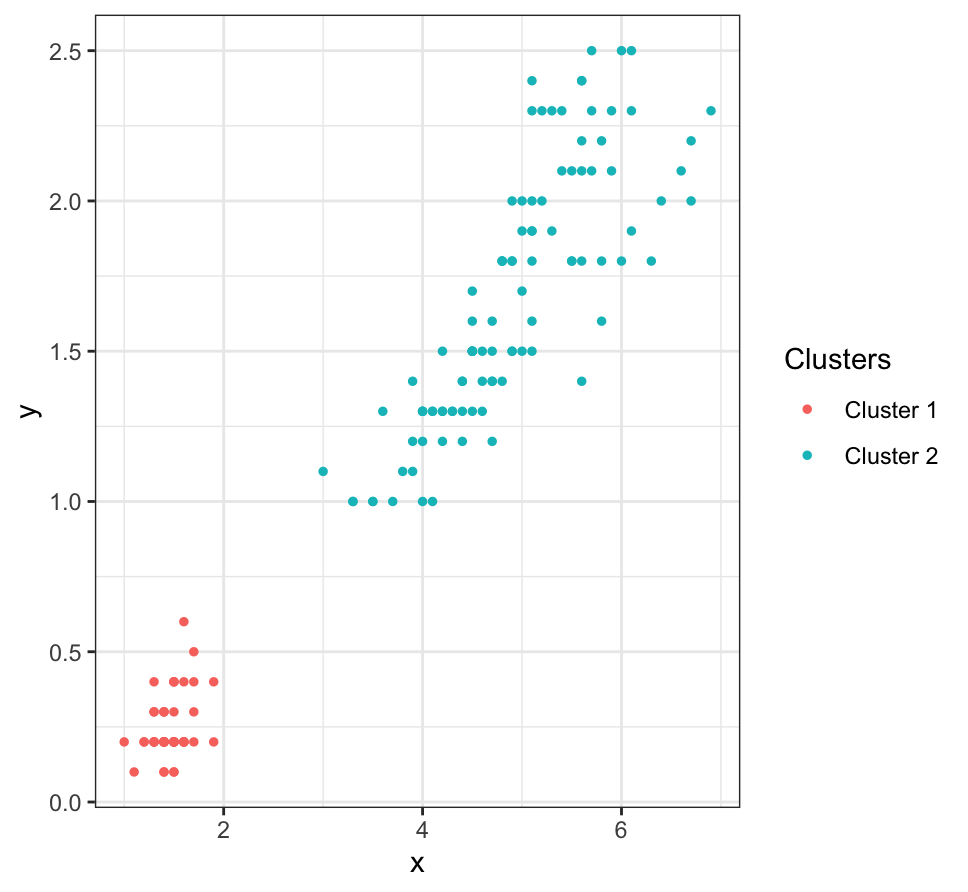
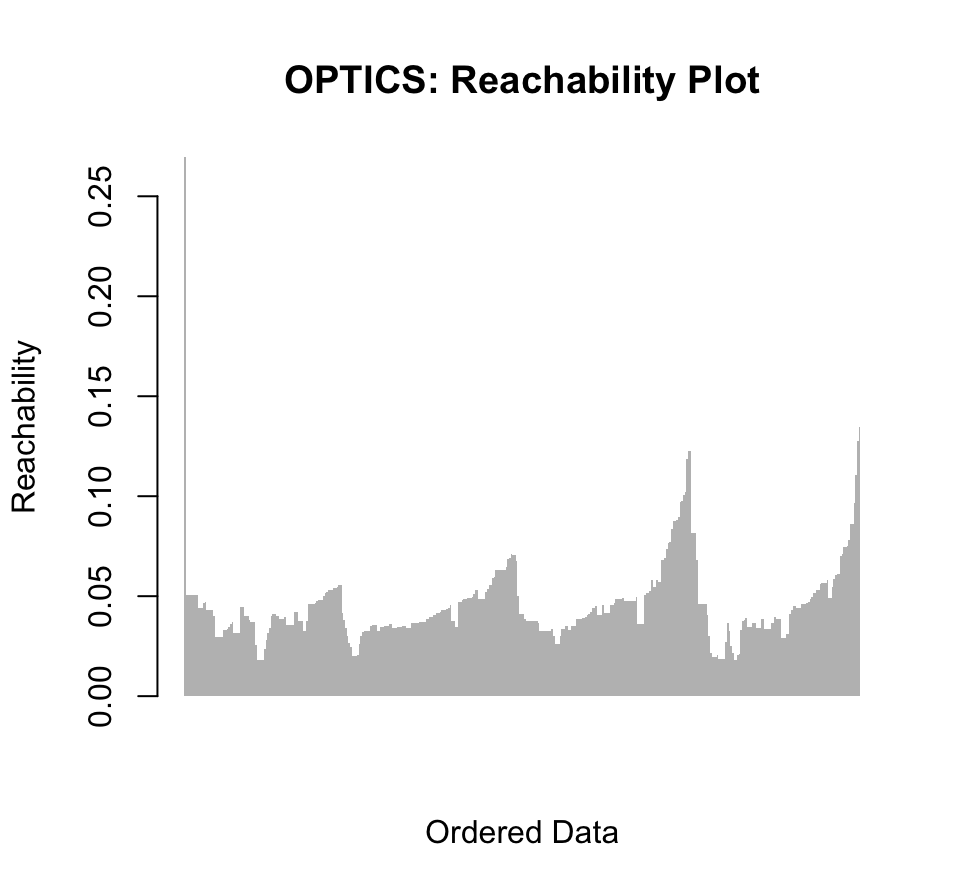
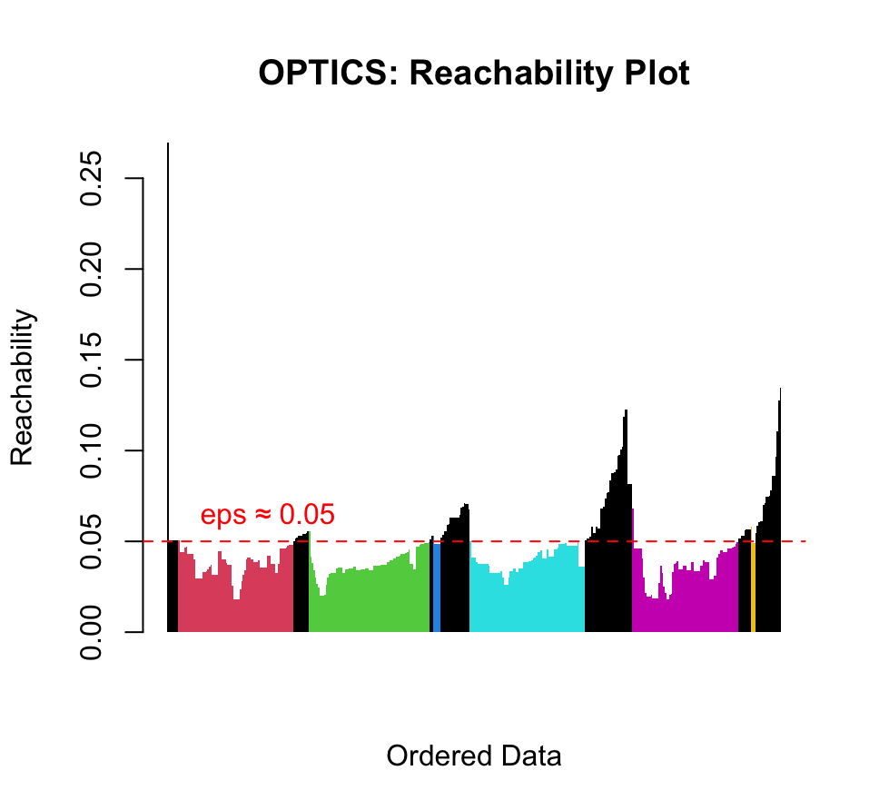
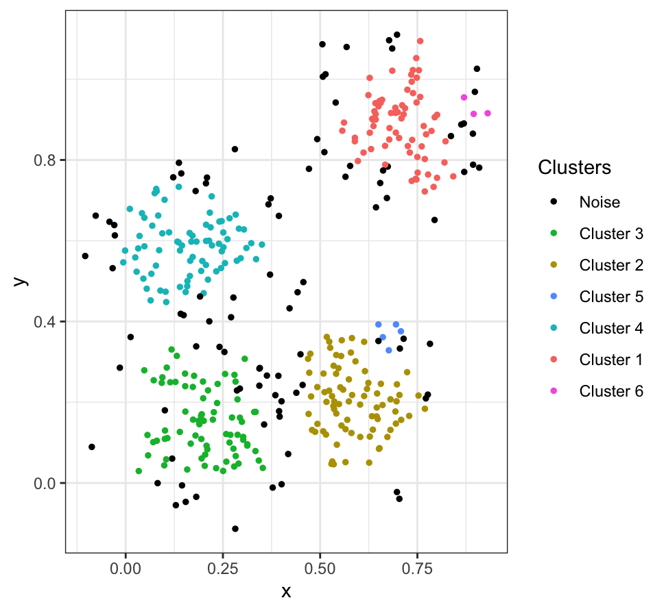
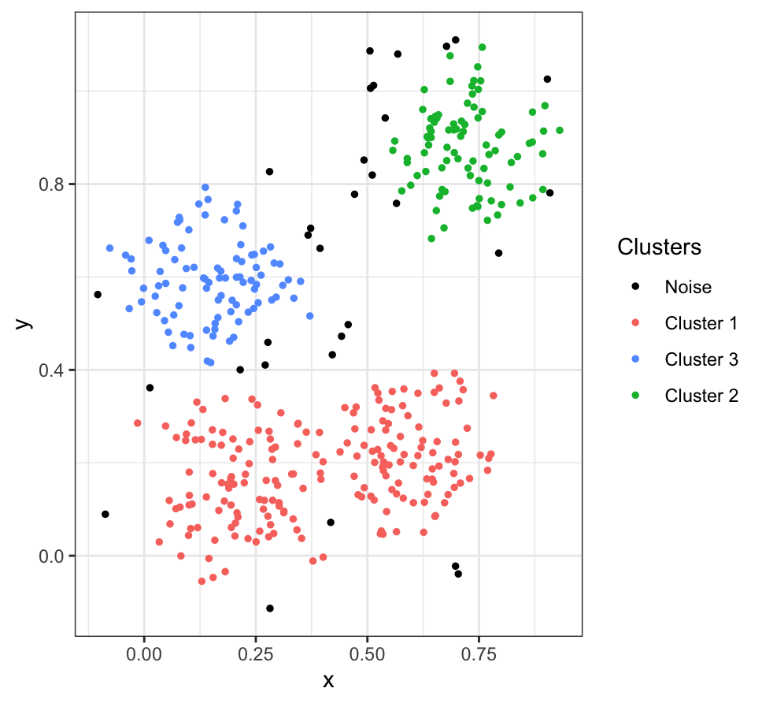
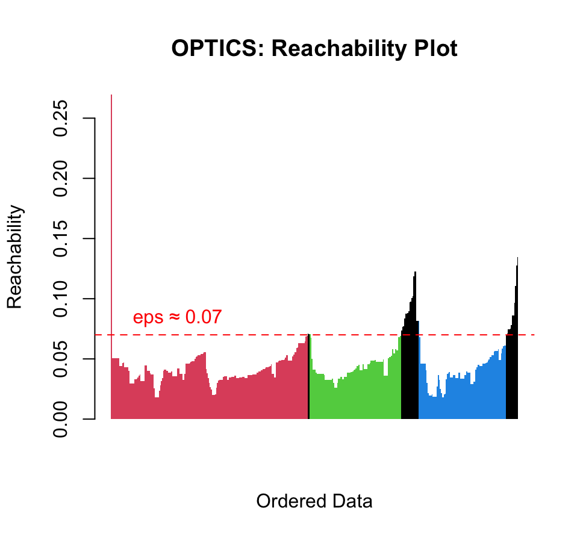

```{r, include = FALSE}
knitr::opts_chunk$set(
  collapse = TRUE,
  comment = "#>"
)

```

```{r setup}
library(Clustering)
```

## Overview OPTICS algorithm

The `Clustering` package includes an implementation of the Ordering points to identify the clustering structure (OPTICS) algorithm.

It is an algorithm for finding density based clusters in spatial data. 

It's basic idea is similiar to the DBSCAN algorithm, both algorithm 'group' objects, by identifying core points with sufficient neighbors and expand clusters from these core points.

However, while DBSCAN uses a fixed radius to form clusters, OPTICS builds an ordering of the data points and a reachability to handle varying densities of clusters more flexibly.

The clusters then can be extracted later on.

A broader overview to the functionality of this algorithm can be found [here](https://de.wikipedia.org/wiki/OPTICS).

### Implementation

In this package the OPTICS algorithm can be called as a function 'optics'.

As input it takes `data` a matrix in $\mathbb{R}^n \times \mathbb{R}^d$, where each row represents a data point.
A second input is a parameter `eps` in $\mathbb{R}^+$, which is used to find the neighborhood of a point using the euclidean distance.
A third input is `minPts`, the minimum number of data points q in the neighborhood of a data point p (including p itslef), such that p is a core point.

The return of this function is a list of 3 elements, an `ordered_list` that returns an ordering of the indices of the `data` points as obtained by the algorithm. A vector `reachability` which stores the reachability distances of the data points in the original order of the data and the eps value that was used to run `optics`.


In the following we present some examples of the implemented algorithm and further
related functions.

```{r}
irisPetals <- iris |> dplyr::select(c(Petal.Length,Petal.Width)) |> data.matrix()
```

The optics algorithm can be run to obtain the exact clustering as DBSCAN. In this case we use the same `eps`,
the same `minPts`. As the following example using the `iris` data set shows.

```{r, fig.width=6, fig.height=4, echo=T,message=F, eval = FALSE}
eps <- 0.5
minPts <- 3

optics_result <- optics(irisPetals, 0.5, 3)

plot_optics_2d(irisPetals, optics_result)

```
<div style="text-align: center;">
  
</div>

When using `optics` in a more typical fashion, a rather large `eps` value (e.g. 10) is used to obtain smoother reachability distances. For this we regard some more data

```{r, fig.width=6, fig.height=5, echo=T, message=F, eval= F}
set.seed(2)
n <- 400
x <- cbind(x = runif(4, 0, 1) + rnorm(n, sd = 0.1),y = runif(4, 0, 1) + rnorm(n, sd = 0.1) )

res <- optics(x, 10, 6)

plot_reachability(res)
```
<div style="text-align: center;">
  
</div>

There are different approaches to extracting the density clusters from the reachability distances obtained.
In this package there is only a relatively 'simple' function `extract_dbscan` implemented, which identifies clusters by 'horizontally' cutting the reachability plot with an `eps_prime` value in $[0,\text{eps}]$.

This function works, but for a few border points. It is also callable when using the `plot_reachability` function.

For the example above we obtain a relatively good clustering, if we use a value of `eps_prime` = 0.05 .

```{r, fig.width=6, fig.height=5, echo=T,message=T, eval=FALSE}
plot_reachability(optics_result = res, extract_dbscan = TRUE, eps_prime = 0.05)
```
<div style="text-align: center;">
  
</div>

For further visualization, one can plot these clusters for data with points in 2 dimensions with the function `plot_optics_2d`.

The function `extract_dbscan` is also executed when calling this function. So one can also input an `eps_prime` value. The default is the `eps` value from the result of the
optics algorithm.


```{r, fig.width=6, fig.height=4, echo=T,message=T, eval =FALSE}
plot_optics_2d(x, optics_result = res, eps_prime = 0.05)
```
<div style="text-align: center;">
  
</div>

That different `eps_prime` will extract different clusterings can be seen, when for example chosing `eps_prime` = 0.07 .

```{r, fig.width=6, fig.height=4, echo=T,message=T, eval =FALSE}
plot_optics_2d(x, optics_result = res, eps_prime = 0.07)
```
<div style="text-align: center;">
  
</div>

```{r, fig.width=6, fig.height=5, echo=T,message=T, eval=FALSE}
plot_reachability(optics_result = res, extract_dbscan = TRUE, eps_prime = 0.07)
```
<div style="text-align: center;">
  
</div>

Extracting clusters with different `eps_prime` values allows us to identify clusters of different density, after running `optics` just once.

